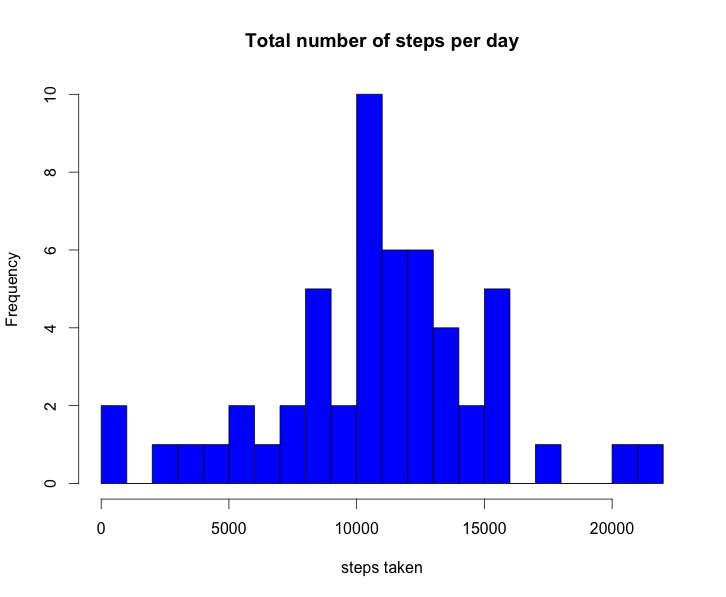
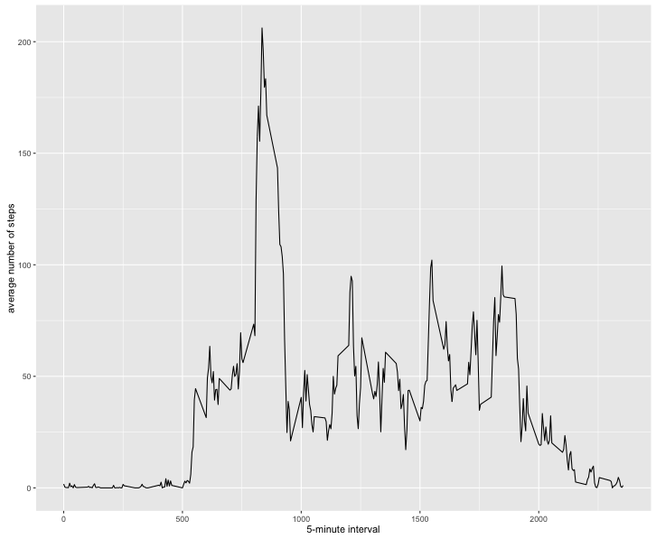
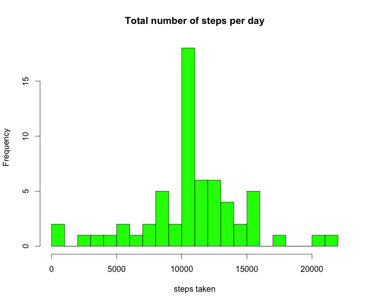

## Loading and preprocessing the data
```{r}
activity <- read.csv("activity.csv")
```

## What is mean total number of steps taken per day?
```{r echo=TRUE}
library(ggplot2)
total_steps <- aggregate(activity$steps, by=list(activity$date), FUN=sum, na.rm=FALSE)
```

```{r eval=FALSE}
hist(total_steps$x, 
     breaks=20,
     main="Total number of steps per day", 
     col="blue", 
     xlab="steps taken")
```


```{r}
mean(total_steps$x, na.rm=TRUE)
median(total_steps$x, na.rm=TRUE)
```



## What is the average daily activity pattern?
1. Make a time series plot (i.e. type = "l") of the 5-minute interval (x-axis) and the average number of steps taken, averaged across all days (y-axis). In other words: what is the average number of steps taken for each interval across all days (note that interval IDs repeat every 24h).

```{r echo=TRUE}
averages <- aggregate(x=list(steps=activity$steps), by=list(interval=activity$interval),
                      FUN=mean, na.rm=TRUE)
```

```{r eval=FALSE}
ggplot(data=averages, aes(x=interval, y=steps)) +
    geom_line() +
    xlab("5-minute interval") +
    ylab("average number of steps")
```




2. On average across all the days in the dataset, which 5-minute interval contains
the maximum number of steps?
```{r echo=TRUE}
averages[which.max(averages$steps),]
```

## Imputing missing values

There are many days/intervals where there are missing values (coded as `NA`). The presence of missing days may introduce bias into some calculations or summaries of the data.

```{r how_many_missing, echo=TRUE}
missing <- is.na(activity$steps)
# How many missing
table(missing)
```

All of the missing values are filled in with mean value for that 5-minute
interval.

```{r echo=TRUE}
# Replace each missing value with the mean value of its 5-minute interval
fill_value <- function(steps, interval) {
    filled <- NA
    if (!is.na(steps))
        filled <- c(steps)
    else
        filled <- (averages[averages$interval==interval, "steps"])
    return(filled)
}
filled_data <- activity
filled_data$steps <- mapply(fill_value, filled_data$steps, filled_data$interval)
```

Using the filled data set, make a histogram of the total number of steps taken each day and calculate the mean and median total number of steps.

```{r echo=TRUE}
total_stepsf <- aggregate(filled_data$steps, by=list(filled_data$date), FUN=sum)
```

```{r eval=FALSE}
hist(total_stepsf$x, 
     breaks=20,
     main="Total number of steps per day", 
     col="green", 
     xlab="steps taken")
```


```{r}
mean(total_stepsf$x)
median(total_stepsf$x)
```



There aren't huge differences between the mean and median values of the datasets. Firstly, this is because the calculation of the mean/median values of the original dataset can only be calculated after NA values are removed. Secondly, this is because the missing values which are filled in are based on the means of the interval, meaning the newly calculated mean is closer to the mean values of the first dataset, regardless. There is no big difference between mean and median steps between the two datasets.

## Are there differences in activity patterns between weekdays and weekends?
First, find the day of the week for each measurement of the data. Here, 
we use the dataset that has the filled-in values.

```{r echo = TRUE}
wk_wd <- function(date) {
    day <- weekdays(date)
    if (day %in% c("Monday", "Tuesday", "Wednesday", "Thursday", "Friday"))
        return("weekday")
    else if (day %in% c("Saturday", "Sunday"))
        return("weekend")
    else
        stop("invalid date")
}
filled_data$date <- as.Date(filled_data$date)
# New factor variable
filled_data$day <- sapply(filled_data$date, FUN=wk_wd)
head(filled_data)
```

Now, we'll make a panel plot with plots of average number of steps taken
on weekdays and weekends.
```{r echo = TRUE}
averages <- aggregate(steps ~ interval + day, data=filled_data, mean)
```

```{r eval=FALSE}
ggplot(averages, aes(interval, steps)) + geom_line() + facet_grid(day ~ .) +
    xlab("5-minute interval") + ylab("Number of steps")
```


